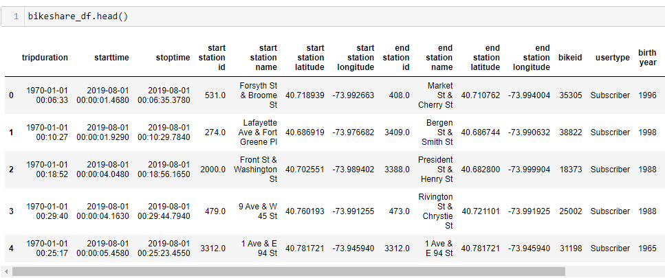
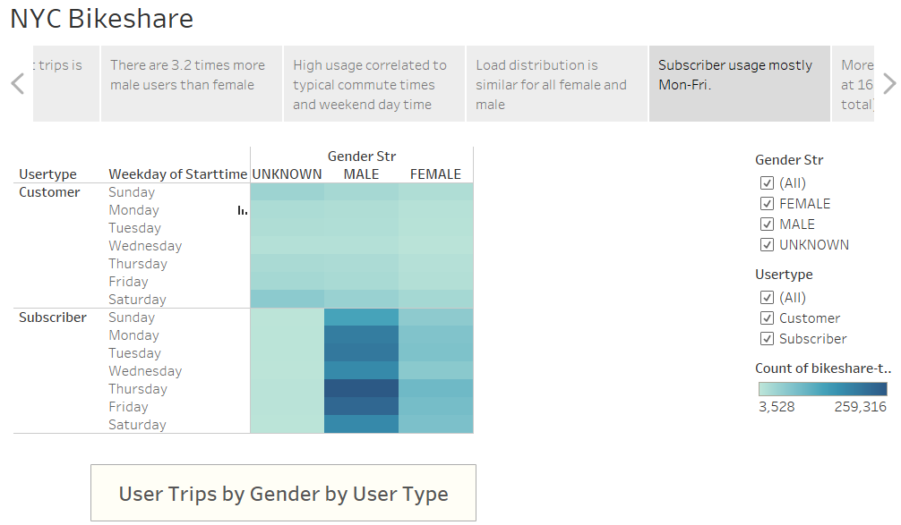

# Bikesharing Challenge

## Overview of the Analysis

This analysis is the 14th weekly challenge of the Data Science Bootcamp. It allows us to put into practice and showcase the skills learned in *Module 14 - Tableau* of the bootcamp.

### Purpose

On this analysis we present some visualizations based on NYC Bikeshare data. These visualizations are aimed to help guide the business proposal for a similar bike-sharing program in Des Moines.

## Results

A Tableau Story was created and published at:

 [https://public.tableau.com/app/profile/jose.orellana6710/viz/Bikeshare-Challenge/NYCBikeshare](https://public.tableau.com/app/profile/jose.orellana6710/viz/Bikeshare-Challenge/NYCBikeshare)

### Process -- Deliverable 1: Change Trip Duration to a Datetime Format

The data in provided in the csv file was transformed using Python.  The ```tripduration``` column was converted from seconds to a datetime datatype.  Additionally, I created a ```gender_str``` variable that carries the gender category as a string.

To conver the ```tripduration``` I used the following code:

```python
# 3. Convert the 'tripduration' column to datetime datatype.
bikeshare_df['tripduration']= pd.to_datetime(bikeshare_df['tripduration'], unit='s')
```

After reviewing that the output dataframe was I expected, the data was exported without the index column to a new .csv file.



```python
# 5. Export the Dataframe as a new CSV file without the index.
bikeshare_df.to_csv('bikeshare-tripdata-edited.csv', index = False)
```

### Process -- Deliverable 2: Create Visualizations for the Trip Analysis

The following visualizations were created as requested:

- Checkout Duration for Users Line Graph
- Checkout Duration for By Gender Line Graph
- Trips by hour by Weekday Heatmap
- Trips by hour by Weekday by Gender Heatmap
- Trips by Weekday by User Type Heatmap

Additionally, I created 2 dashboards composed of 3 worksheets each:

- Dashboard for Start Station analysis
- Dashboard for End Station analysis

### Analysis of Visualizations

The visualizations can be accessed at:   [https://public.tableau.com/app/profile/jose.orellana6710/viz/Bikeshare-Challenge/NYCBikeshare](https://public.tableau.com/app/profile/jose.orellana6710/viz/Bikeshare-Challenge/NYCBikeshare)

#### 1. Checkout Duration

From the plot below we can see that most of the trips had a duration of less than 1hr, moreover, most of the checkouts had a duration of under 20mins.


#### 2. Checkout Duration by Gender

The distribution of the duration of checkout holds for males and females, with short duration (<20mins) covering most of the trips. In this plot it can also be seen than there are about 3.2 more male-user trips than female-user trips.


#### 3. Trips by Weekday by Hour

A heatmap of the number of trips start times indicated that there is a correlation between usage and typical commuting hours. Periods of high utilization at 7-9am and 4-8pm Monday through Friday.

Usafe on the weekend is relatively constant throughout the hours 10am-7pm.


#### 4. Trips by Weekday by Hour by Gender

A similar heatmap by gender confirms that the previous usage correlation holds for Male and Female users.  Unknown gender users peak during the weekend, however, these may correlate to Customers without a subscription and incomplete information.


#### 5. Trips by Weekday by Usertype by Gender

The following heatmap shows that Subscribers usage is higher from Monday to Friday, while Customers (unsubscribed users) take most of their trips over the weekend.



#### 6. Top Start Locations

It was determined that 163 stations generate 50% of the trips.  That is 20.5% of all 794 possible stations.  Further analysis of peak use would be necessary to determine sizing of stations.


#### 7. Top End Locations

It was determined that 153 stations receive 50% of the trips.  That is 19.2% of all 794 possible stations.  Further analysis of peak use would be necessary to determine sizing of high volume stations.


## Summary

The analysis highlights the following information on the NYC Bikeshare data:

- Trips are in general of short duration (<20mins).
- Peak trip hours match typical commute times.
- Subscribed users do most of the trips. Thus, this should be encouraged.
- Female users are under-represented and possible indicate an area of growth. Further understanding of the underlying reasons for this is needed.
- There are stations that are heavily utilised. It will be important to estimate those for initial design parameters of those stations.

### Further work

Additional work could be performed by looking at stations with high utilisation. A few more plots would help determine the actual load as well as peak size/holding requirements:

- trips started per hour per day from individual top 10 stations.
- trips ended per hour per day from individual top 10 stations.

Another item for a business proposal would be to identify the number of idle bicycles during a significant period of time.  This would represent an excess of assets.
